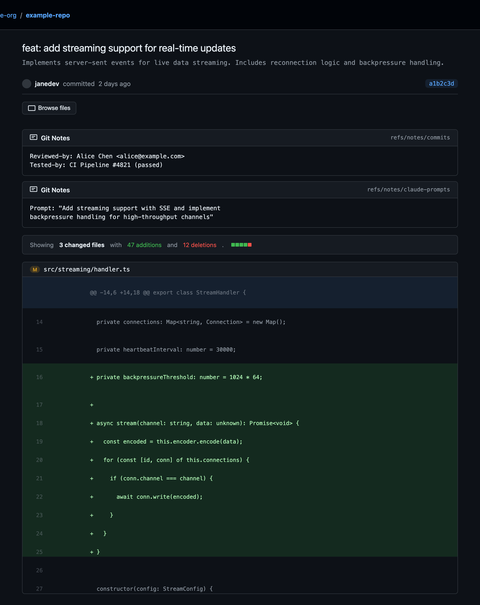

# GitHub Git Notes Viewer

A browser extension that displays [git notes](https://git-scm.com/docs/git-notes) inline on GitHub commit pages.

Git notes are a powerful but underused Git feature — they let you attach metadata to commits without modifying them. However, GitHub's web UI doesn't display git notes at all. This extension fills that gap: when you view a commit on GitHub, it fetches and displays any associated git notes right on the page.

## Screenshots

**Single note ref** — review metadata displayed inline above the diff:


**Multiple note refs** — supports checking several refs at once (e.g. `refs/notes/commits` + `refs/notes/claude-prompts`):



## Install

1. Clone this repository
2. **Chrome/Edge**: Go to `chrome://extensions`, enable "Developer mode", click "Load unpacked", select this directory
3. **Firefox**: Go to `about:debugging#/runtime/this-firefox`, click "Load Temporary Add-on", select `manifest.json`
4. Open the extension settings and add a [GitHub Personal Access Token](https://github.com/settings/tokens) with `repo` scope

## How It Works

There is no dedicated GitHub API for git notes. The extension uses GitHub's low-level Git objects endpoints to traverse the notes ref:

1. `GET /repos/{owner}/{repo}/git/ref/notes%2Fcommits` — resolve the notes ref to a commit SHA
2. `GET /repos/{owner}/{repo}/git/commits/{sha}` — get the tree SHA from the commit
3. `GET /repos/{owner}/{repo}/git/trees/{treeSha}` — list entries mapping commit SHAs to blob SHAs
4. `GET /repos/{owner}/{repo}/git/blobs/{blobSha}` — fetch and decode the note content

The notes tree is cached in memory for 5 minutes, so revisiting commits in the same repo typically costs only 1 API call (the blob fetch).

### API call budget

| Scenario | API calls |
|---|---|
| Cold start, note exists | 4 |
| Cached tree, note exists | 1 |
| No notes in repo | 1 (404 on ref) |
| Fanout (large repo, cold) | 5 |

## Configuration

Open the extension options page to configure:

- **GitHub PAT** — required. Create at [github.com/settings/tokens](https://github.com/settings/tokens) with `repo` scope (or `public_repo` for public repos only)
- **Note refs** — which refs to check, one per line. Default: `refs/notes/commits`
- **Clear cache** — flush the in-memory notes tree cache

## Development

```
npm install
npm test              # Run E2E tests
npm run screenshots   # Regenerate README screenshots
```

### Project structure

```
├── manifest.json       MV3 manifest (Chrome + Firefox)
├── background.js       Service worker: GitHub API, caching, message handling
├── content.js          Content script: detect commits, inject notes UI
├── content.css         Styles matching GitHub's design language
├── popup.html/js/css   Toolbar popup: auth status, settings link
├── options.html/js/css Options page: PAT, note refs, cache
├── icons/              Extension icons
├── test/               E2E tests and screenshot generator
└── screenshots/        Generated screenshots for README
```

## Cross-browser support

- **Chrome / Edge**: Manifest V3 service worker
- **Firefox**: Manifest V3 background scripts (dual declaration in manifest)
- Uses `browser.storage.local` for persistence (works everywhere)

## License

MIT

---

<p align="center">
  <a href="https://trailblaze.work">
    
  </a>
</p>
<h3 align="center">Built by <a href="https://trailblaze.work">Trailblaze</a></h3>
<p align="center">
  We help companies deploy AI across their workforce.<br>
  Strategy, implementation, training, and governance.<br><br>
  <a href="mailto:hello@trailblaze.work"><strong>hello@trailblaze.work</strong></a>
</p>
